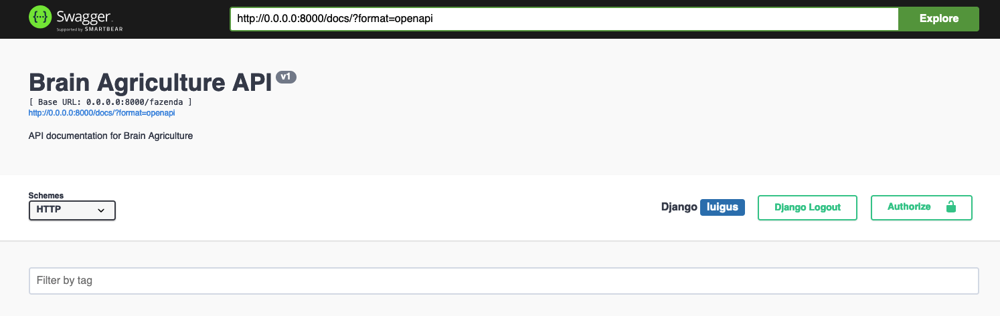
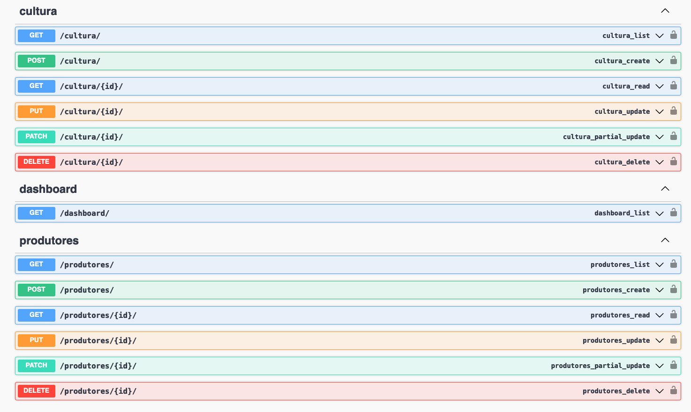

# Brain Agriculture

## Required technologies

* [Python] - Python in version >= 3.12
* [Postgres] - Database
* [Django] - Web Python lib
* [UV] - uv is and extremely fast Python package and resolver.
* [Pip] - Simple python packager manager


## Clone project

```sh
$ git clone https://github.com/luigus/brain-agriculture.git
```


## Setup project
#### Using pip and virtualenv
```sh
$ cd brain-agriculture/
$ python -m venv .venv -p python3.12
$ source .venv/bin/activate
$ pip install --upgrade pip
$ pip install uv
$ uv pip install -r requirements.txt
```


## Setup database
#### Setup the database with the registration of companies and reviewers
```sh
$ cd brain-agriculture/agro
$ python manage.py makemigrations
$ python manage.py migrate
$ python manage.py load_mock_data #load mock data to database
```

## Executar o Django Web App

```sh
$ cd brain-agriculture
$ source .venv/bin/activate
$ cd agro/
$ python manage.py runserver 0.0.0.0:8000
```

#### The following list of links will be available after the project starts
* http://localhost:8000/admin
* http://localhost:8000/docs
* http://localhost:8000/fazenda/

## Admin site 
* Link: http://localhost:8000/admin
#### Para acessar a área de admin, é necessário criar um super user
```sh
$ cd brain-agriculture
$ source .venv/bin/activate
$ cd agro/
$ python manage.py createsuperuser
```
Acesse o endpoint /admin para e insira o usuário e a senha
* http://localhost:8000/admin
* Username: <'USERNAME'>
* Password: <'PASSWORD'>


## Run the application with docker 
```sh
$ docker-compose up
```

## Endpoints APIs
* http://localhost:8000/docs



#

## Assinaturas dos endpoints

* http://localhost:8000/cultura
```
[
  {
    "nome": "soja"
  },
  {
    "nome": "milho"
  },
  {
    "nome": "algodao"
  },
  {
    "nome": "cafe"
  },
  {
    "nome": "cana_acucar"
  }
]
```

#
* http://localhost:8000/produtores
```
[
  {
    "cpf": "04085645633",
    "cnpj": null,
    "nome_produtor": "Luiz",
    "nome_fazenda": "Feliz",
    "cidade": "Belo Horizonte",
    "estado": "MG",
    "area_total": "12.00",
    "area_agricultavel": "6.00",
    "area_vegetacao": "6.00",
    "culturas_plantadas": [
      {
        "nome": "soja"
      },
      {
        "nome": "cana_acucar"
      }
    ]
  },
  {
    "cpf": null,
    "cnpj": "03157849000161",
    "nome_produtor": "Maria Sophia Abreu",
    "nome_fazenda": "Marques",
    "cidade": "Costela",
    "estado": "MS",
    "area_total": "235.97",
    "area_agricultavel": "147.62",
    "area_vegetacao": "88.35",
    "culturas_plantadas": [
      {
        "nome": "soja"
      },
      {
        "nome": "milho"
      },
      {
        "nome": "algodao"
      }
    ]
  },
  {
    "cpf": "25396740892",
    "cnpj": null,
    "nome_produtor": "Pedro Henrique da Luz",
    "nome_fazenda": "Alves",
    "cidade": "Rocha",
    "estado": "RO",
    "area_total": "527.43",
    "area_agricultavel": "448.15",
    "area_vegetacao": "79.28",
    "culturas_plantadas": [
      {
        "nome": "algodao"
      },
      {
        "nome": "cafe"
      }
    ]
  },
  {
    "cpf": "57386294182",
    "cnpj": null,
    "nome_produtor": "Lucas Gabriel Araújo",
    "nome_fazenda": "Campos",
    "cidade": "Marques",
    "estado": "AP",
    "area_total": "820.23",
    "area_agricultavel": "461.20",
    "area_vegetacao": "359.03",
    "culturas_plantadas": [
      {
        "nome": "milho"
      },
      {
        "nome": "cafe"
      }
    ]
  },
  {
    "cpf": null,
    "cnpj": "95871623000146",
    "nome_produtor": "Sr. Anthony Peixoto",
    "nome_fazenda": "Moraes",
    "cidade": "da Cunha de Camargo",
    "estado": "ES",
    "area_total": "753.58",
    "area_agricultavel": "415.57",
    "area_vegetacao": "338.01",
    "culturas_plantadas": [
      {
        "nome": "soja"
      },
      {
        "nome": "algodao"
      },
      {
        "nome": "cafe"
      }
    ]
  },
  {
    "cpf": "85267490130",
    "cnpj": null,
    "nome_produtor": "Maria Vitória da Paz",
    "nome_fazenda": "Pires Cardoso S/A",
    "cidade": "Correia",
    "estado": "DF",
    "area_total": "154.27",
    "area_agricultavel": "127.15",
    "area_vegetacao": "27.12",
    "culturas_plantadas": [
      {
        "nome": "algodao"
      },
      {
        "nome": "cana_acucar"
      }
    ]
  },
  {
    "cpf": null,
    "cnpj": "31908247000134",
    "nome_produtor": "Bella Mendes",
    "nome_fazenda": "Cavalcante - ME",
    "cidade": "da Luz",
    "estado": "ES",
    "area_total": "383.19",
    "area_agricultavel": "255.64",
    "area_vegetacao": "127.55",
    "culturas_plantadas": [
      {
        "nome": "soja"
      },
      {
        "nome": "milho"
      },
      {
        "nome": "cana_acucar"
      }
    ]
  },
  {
    "cpf": null,
    "cnpj": "07639148000110",
    "nome_produtor": "Bruna Guerra",
    "nome_fazenda": "Rios - EI",
    "cidade": "Camargo do Sul",
    "estado": "MT",
    "area_total": "250.40",
    "area_agricultavel": "223.64",
    "area_vegetacao": "26.76",
    "culturas_plantadas": [
      {
        "nome": "algodao"
      },
      {
        "nome": "cana_acucar"
      }
    ]
  },
  {
    "cpf": "08324765956",
    "cnpj": null,
    "nome_produtor": "Luiza Barros",
    "nome_fazenda": "Fogaça Santos - ME",
    "cidade": "Guerra da Serra",
    "estado": "PI",
    "area_total": "588.21",
    "area_agricultavel": "309.75",
    "area_vegetacao": "278.46",
    "culturas_plantadas": [
      {
        "nome": "cana_acucar"
      }
    ]
  },
  {
    "cpf": "56213980768",
    "cnpj": null,
    "nome_produtor": "José Miguel Alves",
    "nome_fazenda": "Costa Duarte - ME",
    "cidade": "Cavalcanti",
    "estado": "PB",
    "area_total": "961.49",
    "area_agricultavel": "696.52",
    "area_vegetacao": "264.97",
    "culturas_plantadas": [
      {
        "nome": "soja"
      },
      {
        "nome": "algodao"
      },
      {
        "nome": "cafe"
      }
    ]
  },
  {
    "cpf": null,
    "cnpj": "79132684000135",
    "nome_produtor": "Sra. Maysa Viana",
    "nome_fazenda": "Jesus Moura Ltda.",
    "cidade": "Jesus",
    "estado": "MG",
    "area_total": "154.92",
    "area_agricultavel": "122.54",
    "area_vegetacao": "32.38",
    "culturas_plantadas": [
      {
        "nome": "soja"
      },
      {
        "nome": "cafe"
      },
      {
        "nome": "cana_acucar"
      }
    ]
  }
]
```

#
* http://localhost:8000/dashboard
```
{
  "total_fazendas": 11,
  "total_hectares": 4841.69,
  "dados_por_estado": [
    {
      "estado": "PB",
      "total_area": 961.49
    },
    {
      "estado": "PI",
      "total_area": 588.21
    },
    {
      "estado": "RO",
      "total_area": 527.43
    },
    {
      "estado": "MS",
      "total_area": 235.97
    },
    {
      "estado": "DF",
      "total_area": 154.27
    },
    {
      "estado": "MG",
      "total_area": 166.92
    },
    {
      "estado": "ES",
      "total_area": 1136.77
    },
    {
      "estado": "AP",
      "total_area": 820.23
    },
    {
      "estado": "MT",
      "total_area": 250.4
    }
  ],
  "dados_por_cultura": [
    {
      "culturas_plantadas__nome": "cana_acucar",
      "total_area": 1542.99
    },
    {
      "culturas_plantadas__nome": "milho",
      "total_area": 1439.39
    },
    {
      "culturas_plantadas__nome": "cafe",
      "total_area": 3217.65
    },
    {
      "culturas_plantadas__nome": "algodao",
      "total_area": 2883.14
    },
    {
      "culturas_plantadas__nome": "soja",
      "total_area": 2501.15
    }
  ],
  "dados_por_uso_solo": {
    "agricultavel": 3213.78,
    "vegetacao": 1627.91
  }
}

```
